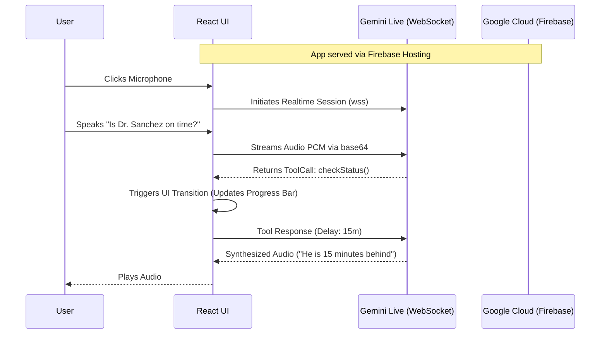

# ZeroWait - Google AI Hackathon Submission 🗣️

**Category:** Live Agents (Real-time Interaction)

## Project Overview

**ZeroWait** is a voice-first appointment timing assistant designed for doctor's offices. Instead of patients continually interrupting the front desk to ask "Is the doctor running on time?", this application provides a calm, interactive conversational interface powered by **Gemini 2.0 Live**.

The agent does more than just chat: it utilizes **Function Calling (Tools)** embedded directly into the Live WebSocket stream to manipulate the React User Interface dynamically in real time. When the Gemini model decides to fetch the doctor's schedule or confirm a patient's delay, the UI instantly reflects those actions without page reloads.

## Architecture

Our application is built on a React/Vite frontend that communicates directly with the Gemini Multimodal Live API via WebSockets. The entire application is hosted automatically via **Google Cloud Firebase Hosting**.



### Core Technologies
- **@google/genai**: Native SDK used for bridging the multimodal live session.
- **Bi-directional WebSockets**: Used for zero-latency audio streaming (PCM 16000Hz) and real-time Tool Calling.
- **Vite & React**: The client-side framework managing the complex state machine mappings.
- **Google Cloud Firebase**: Provides edge-to-edge static hosting for the compiled frontend.

## Local Spin-up Instructions

To verify the code and run this exact application locally:

1. **Clone the repository:**
   ```bash
   git clone https://github.com/nuriygold/zerowait-desktop.git
   cd zerowait-desktop
   ```

2. **Install dependencies:**
   ```bash
   npm install
   ```

3. **Configure the Gemini API Key:**
   Create a `.env` file in the root of the project and insert your Gemini API key. Ensure it has access to the experimental Gemini 2.0 models.
   ```bash
   VITE_GEMINI_API_KEY=your_key_here
   ```

4. **Start the development server:**
   ```bash
   npm run dev
   ```

5. **Interact:**
   Navigate into the provided localhost port (e.g., `http://localhost:5173`). Click the main microphone button to initiate the WebSocket connection and speak your prompt.

## Cloud Deployment Proof
This repository is configured to deploy directly to Firebase Hosting via `firebase.json` and `.firebaserc`.

**Live Demo URL:** [https://zerowait-desktop.web.app/](https://zerowait-desktop.web.app/)
